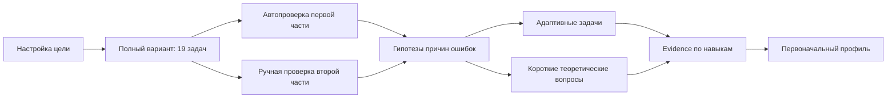

# Этап 2. Стартовая диагностика нового ученика

## Граница этапа

Этап использует карту знаний версии 2 и не меняет её структуру. Реализованы сценарий стартовой диагностики, журнал поведения, адаптивный уточняющий блок, ручная проверка второй части, evidence и первоначальная проекция знаний.

Не реализованы:

- персональный учебный маршрут;
- интерактивная дорожная карта;
- расписание повторений;
- интерфейс диагностики.

## Полный сценарий



Полный вариант не меняется по ходу решения. Адаптация начинается только после его отправки, чтобы результат оставался сопоставимым с полноценным пробником.

## Что ученик указывает до начала

Обязательные данные:

- целевой балл от 1 до 100;
- дата экзамена;
- доступное время в неделю;
- дни недели для подготовки;
- предпочтительная длительность одного занятия.

Необязательные данные:

- балл последнего пробника;
- разделы, темы или подтемы карты, которые ученик ещё не изучал.

Самооценка «не изучал» не считается доказанным пробелом. Она создаёт слабое evidence типа `SELF_REPORT` и состояние `UNSTUDIED`, пока не появятся результаты заданий.

## Полноценный вариант

Вариант содержит по одной опубликованной и размеченной задаче каждого номера 1–19. Выбор воспроизводим: одинаковый идентификатор сессии всегда даёт тот же набор.

Диагностический вариант создаётся только когда для каждого номера есть хотя бы одна задача, связанная с навыками карты через `TaskSkill`. Если банк неполон, система явно сообщает недостающий номер и не создаёт ложную диагностику.

Глобальный лимит времени хранится в сессии вместе с версией алгоритма. Начальное значение — 235 минут. Ожидаемое время отдельной задачи используется только как диагностический ориентир, а не как отдельный жёсткий таймер.

## Какие данные собираются во время решения

Для ответа:

- финальный короткий ответ;
- текст развёрнутого решения;
- прикреплённые PDF или изображения;
- уверенность ученика от 1 до 5;
- явное действие «пропустить»;
- явное действие «ещё не изучал».

Для поведения:

- первое открытие задания;
- активное и полное время;
- время вне вкладки;
- потеря и восстановление фокуса;
- количество изменений ответа;
- отметка «вернуться позже»;
- факт сохранения черновика.

События поведения хранятся отдельно от ответа. Сервер проверяет их время и принадлежность сессии. Потеря фокуса, скорость или число изменений никогда сами по себе не создают отрицательную оценку знания.

Не собираются содержимое буфера обмена, нажатия отдельных клавиш и другие избыточные данные.

## Время и пропуски

Различаются три ситуации:

1. `SKIPPED` — ученик видел задание и сознательно пропустил. Это слабое отрицательное evidence с весом 0,3.
2. `UNSTUDIED` — ученик явно сообщил, что материал не изучал. Это самооценка, а не измеренное незнание.
3. `NOT_REACHED` — время варианта закончилось до перехода к заданию. Отрицательное evidence не создаётся; формируется гипотеза `TIME_PRESSURE`.

Ошибочный быстрый ответ после исчерпания времени получает минимальный вес. Чтобы отличить дефицит времени от незнания, система сравнивает результат с последующим коротким заданием на тот же навык без давления общего таймера.

## Возможное угадывание

Правильный ответ помечается как возможное угадывание, если одновременно:

- активное время меньше 20% ожидаемого;
- уверенность ученика не выше 2 из 5;
- нет видимого решения.

Такой ответ остаётся правильным, но его evidence получает 35% обычного веса. Затем предлагается одна короткая проверка того же навыка. Повторный независимый успех снимает гипотезу; неуспех подтверждает необходимость дополнительной проверки, но не переписывает первый ответ.

## Частичное решение и вторая часть

Задания второй части не проверяются сравнением строки ответа. Ученик может:

- написать решение текстом;
- приложить до пяти файлов PDF, JPG, PNG или WEBP;
- указать уверенность.

Ответ получает состояние `AWAITING_REVIEW`. Преподаватель выставляет балл по критериям и для каждого шага может указать навык и тип ошибки:

- вычислительная;
- концептуальная;
- моделирование;
- логика;
- обозначения;
- неполное решение;
- неверное чтение условия.

Evidence рассчитывается отдельно по каждому критерию как отношение полученного балла к максимальному. Это позволяет не превращать решение на 2 балла из 3 в бинарную ошибку.

Модель `TaskRubricCriterion` предусмотрена для постоянных критериев задачи. Перед промышленным запуском критерии существующих заданий №13–19 должен проверить преподаватель.

## Как определяется причина ошибки

После неправильного ответа создаются гипотезы, а не окончательные выводы:

- пробел основного навыка;
- пробел обязательной предпосылки;
- вычислительная ошибка;
- неверное чтение условия;
- нехватка времени;
- невнимательность;
- материал не изучался;
- возможное угадывание.

Вычислительная ошибка подтверждается:

- ручной проверкой, когда способ решения верен, а ошибка локальна; либо
- контрастом: теоретический вопрос и отдельная задача на способ решены правильно, а вычислительный шаг — нет.

Одна неверная финальная строка не считается достаточным основанием назвать ошибку вычислительной.

Незнание темы подтверждается минимум двумя независимыми источниками, например:

- задача полного варианта и адаптивная задача;
- адаптивная задача и теоретический вопрос;
- два разных задания и ручная проверка критерия.

## Пример: тригонометрическое уравнение

Для ошибки в тригонометрическом уравнении банк уточнений разделяет:

1. перевод градусов и радиан;
2. значения и знаки по единичной окружности;
3. основные тождества;
4. формулы приведения и двойного угла;
5. простейшее тригонометрическое уравнение;
6. преобразование исходного уравнения;
7. отбор корней на промежутке.

Selector сначала проверяет обязательную предпосылку с наибольшим влиянием. Поэтому ученик, ошибившийся в окружности, не получает сразу ещё одно сложное уравнение.

## Адаптивный уточняющий блок

Обычный объём — 6–8 вопросов. Жёсткий максимум — 12. Ограничения:

- не более двух вопросов на один навык;
- не более четырёх теоретических вопросов;
- одна и та же задача или шаблон не повторяется;
- явное «не изучал» проверяется одним мягким вопросом, а не серией задач.

Для каждого кандидата вычисляется детерминированный приоритет:

```text
score =
  priorityOfHypothesis
  × uncertainty
  × hypothesisTypeWeight
  × skillImportance
  × difficultyFit
  / expectedMinutes
```

Обязательная предпосылка имеет больший вес, чем верхнеуровневый навык. Теоретический вопрос выбирается только тогда, когда нужно разделить знание правила и умение выполнить процедуру.

Блок останавливается досрочно, если:

- все проверяемые гипотезы подтверждены или отклонены;
- подходящих независимых вопросов нет;
- достигнут допустимый бюджет;
- следующий вопрос почти не меняет уверенность вывода.

Неразрешённая гипотеза получает статус `INSUFFICIENT`, а не принудительное заключение.

## Первоначальный профиль знаний

Каждый результат создаёт неизменяемое `SkillEvidence`:

- навык;
- источник;
- результат от 0 до 1;
- вес;
- ключ независимости;
- понятную причину веса;
- время.

Для измеренных evidence:

```text
alpha = 1 + Σ(weight × score)
beta  = 1 + Σ(weight × (1 - score))
mastery = alpha / (alpha + beta)
```

Уверенность отдельно учитывает:

- суммарный эффективный вес;
- число независимых заданий;
- разнообразие источников.

Статусы:

- `UNKNOWN` — меньше двух независимых подтверждений или уверенность ниже 0,55;
- `UNSTUDIED` — есть только явная самооценка «не изучал»;
- `GAP` — mastery ниже 0,55 при достаточной уверенности;
- `DEVELOPING` — промежуточное подтверждённое состояние;
- `MASTERED` — mastery не ниже 0,8, уверенность не ниже 0,7 и минимум три независимых подтверждения.

Результат одного задания не может создать `GAP` или `MASTERED`.

## Реализованные модели

- `StudentLearningGoal`;
- `AssessmentSession`;
- `AssessmentItem`;
- `AssessmentAttempt` и файлы решения;
- `AssessmentBehaviorEvent`;
- `DiagnosticQuestionTemplate`;
- `DiagnosticHypothesis`;
- `SkillEvidence`;
- `StudentSkillState`;
- `TaskRubricCriterion`;
- `AssessmentReviewCriterion`.

История хранится в evidence и попытках. `StudentSkillState` является пересчитываемой проекцией, а не единственным источником истины.

## API

Ученик:

- `POST /diagnostics`;
- `POST /diagnostics/:publicId/start`;
- `GET /diagnostics/:publicId`;
- `POST /diagnostics/:publicId/items/:itemPublicId/events`;
- `POST /diagnostics/:publicId/items/:itemPublicId/answer`;
- `POST /diagnostics/:publicId/items/:itemPublicId/attachments`;
- `POST /diagnostics/:publicId/exam/finish`;
- `POST /diagnostics/:publicId/clarification/next`.

Преподаватель:

- `GET /teacher/diagnostics/review-queue`;
- `POST /teacher/diagnostics/:sessionPublicId/attempts/:attemptPublicId/review`.

## Ограничения основы

- В стартовом seed есть адресные тригонометрические и несколько фундаментальных уточнений, но производственный банк должен покрыть все навыки несколькими независимыми вопросами.
- Автоматическая разметка задач по теме является начальной. Задачи с несколькими способами решения требуют ручного уточнения `TaskSkill`.
- Критерии второй части нужно занести и проверить преподавателю.
- Сырые поведенческие события не используются как доказательство знания без результата задания.
